# Course Project Report

**\[Conduit App]**

**Course:** Modern Programming Practices

**Block:** July 2025

**Instructor:** Dr. Bright Gee Varghese R

**Team Members:**

\[Amine Atmani]  \[619560]

\[Leonardo Medina]  \[619571]

**Date of Submission:** \[07/16/2001]

---

# Important Project Requirements

**Stream API:**

You must make use of the Java Stream API wherever it is applicable, especially for collection processing, filtering, mapping, aggregation, and other data operations. Clearly highlight these usages in your code and documentation.

**Unit Testing:**

Implement unit tests for your business logic using JUnit or a similar testing framework. Include instructions for running your test suite and ensure your tests cover major functionalities and edge cases.

**Singleton Pattern:**

Where a class should have only one instance (for example, for managing resources, database connections, configuration, etc.), apply the Singleton design pattern.

---

## 1. Problem Description

Conduit App is a Medium.com-style blogging platform API that addresses the need for a clean, modular, and secure backend for publishing articles, managing user profiles, and enabling community engagement.

---

## 2. User Stories

Describe the system from the user's perspective using user stories:

General User:

- As a visitor, I want to register for an account so that I can create and manage content.
- As a user, I want to log in securely using JWT so that I can access personalized features.
- As a user, I want to view articles from other users so that I can stay informed and engaged.
- As a user, I want to favorite articles so that I can easily find them later.
- As a user, I want to follow other authors so that I can see articles from people I like.

Author:

- As an author, I want to create and publish articles so that I can share my thoughts with the community.
- As an author, I want to edit or delete my own articles so that I can keep my content up to date.
- As an author, I want to add tags to articles so that readers can find them more easily.

## 3. Functional Requirements

Authentication:

- Users can register with an email and password.
- Users can log in securely and receive a JWT token.
- JWT is used to secure all protected endpoints.
- No role-based access control (RBAC) is implemented — all users have the same privileges.

Article Management:

- Authenticated users can create and delete articles.
- Articles can be favorited by other users.
- No update/edit or locking/approval mechanism is implemented yet.

Social Features:

- Users can follow or unfollow other users.
- A personalized feed is available showing articles from followed users.

Comments:

- Commenting features are not available in the current implementation (not found in controller).

Tags:

- Tags are auto-created when articles are posted.
- There is no tag-based filtering in the current implementation.

Customer & Region Modules:

- The app includes additional modules for Customer and Region management.
- These are likely for demo, internal use, or extended business logic, not directly tied to blogging features.

## 4. Non-Functional Requirements

Security:

- JWT is used to secure API endpoints.
- No password hashing or encryption is currently applied.

Performance:

- Backend is built with Spring Boot for fast REST API responses.
- Basic pagination is applied to improve API efficiency.

Reliability:

- Stateless API improves resilience.
- Backend logic is grouped by clean controller-service layers.

Scalability:

-The system can be scaled by deploying multiple instances behind a load balancer.

Usability:

- The API follows RESTful standards and returns consistent JSON responses.
- Integrated with Swagger for easy API testing and documentation.

## 5. Architecture of Project

The project uses a full-stack architecture:
    - Frontend: Angular (UI, HTTP requests).
    - Backend: Spring Boot (REST API, business logic).
    - Database: MySQL (via JPA).

Angular calls Spring Boot APIs, which interact with MySQL.

### 5.1 Overview

The project follows a standard layered architecture, which promotes separation of concerns and modularity. The main layers are:

1. Controller Layer (controller):

- Handles HTTP requests and responses.
- Maps REST endpoints to service logic.
- Example: ArticleController, UserController.

2- Service Layer (service.impl):

- Contains the core business logic.
- Orchestrates operations across repositories and other services.
- Example: ArticleService, ProfileService.

3- Repository Layer (repository):

- Interfaces with the database using Spring Data JPA.
- Provides CRUD operations on entities.
- Example: ArticleRepository, UserRepository

4- Domain Layer (domain):

- Contains entity classes representing database tables.
- Used directly by JPA repositories and services.
- Example: Article, User, Comment

5- DTO Layer (dto):

- Holds Data Transfer Objects used for input/output operations.
- Helps isolate domain models from external clients.
- Example: ArticleRequest, UserResponse

6- Security Layer (security):

- Manages JWT authentication and current user context.
- Example: JwtAuthenticationFilter, SecurityConfig

7- Configuration Layer (config, autoconfigure):

- Holds configuration classes for Swagger, CORS, and JPA.
- Example: SwaggerConfig, PersistenceConfig

8- Utility & Error Handling (util, error):

- Util: contains helpers like SlugUtil, HashUtil.
- Error: handles global exception responses and validation errors.

### 5.3 Technologies Used

Backend:

- Java 11
- Spring Boot 2.5.7
- Spring Data JPA
- Spring Security (JWT-based)
- Lombok
- MySQL
- H2 (dev database)
- Swagger (Springfox 3.0.0)

Frontend:

- Angular 16
- Nx Workspace
- RxJS & NgRx
- TypeScript
- Storybook
- Jest & Cypress
- Firebase Tools (deployment)

### 5.4 Layer Descriptions

- Presentation Layer: Handles incoming HTTP requests using controllers. It exposes REST APIs and maps them to appropriate services.

- Service Layer: Contains business logic. It processes data, applies rules, and coordinates between the controller and repository layers.

- Data Access Layer: Uses Spring Data JPA to interact with the database. It provides CRUD operations through repositories.

- Database: MySQL is used as the main relational database to persist all entities like users, articles, comments, etc.

## 6. Use Case Diagram(s)

To be in the future : (Edit comment, Delete comment, Favorite article, Delete article).

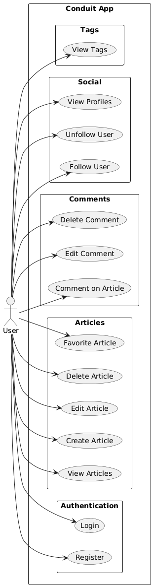

## 7. Use Case Descriptions

Register:

- Use Case Name: Register
- Primary Actor(s): Guest
- Preconditions: User is not logged in
- Postconditions: New account is created
- Main Success Scenario: User provides valid data → system stores user → success response returned

Login:

- Use Case Name: Login.
- Primary Actor(s): Registered User.
- Preconditions: Account exists with correct credentials.
- Postconditions: JWT token is returned.
- Main Success Scenario: User enters credentials → system validates → token returned.

Create Article:

- Use Case Name: Create Article.
- Primary Actor(s): Logged-in User.
- Preconditions: User is authenticated.
- Postconditions: Article is saved and listed.
- Main Success Scenario: User submits article data → article is saved → confirmation returned.

Favorite Article:

- Use Case Name: Favorite Article.
- Primary Actor(s): Logged-in User.
- Preconditions: User is authenticated.
- Postconditions: Article marked as favorite.
- Main Success Scenario: User clicks favorite → system updates favorite count.

Comment on Article:

- Use Case Name: Comment on Article.
- Primary Actor(s): Logged-in User.
- Preconditions: User is authenticated.
- Postconditions: Comment added to article.
- Main Success Scenario: User submits comment → system saves it → displayed under article.

Follow User:

- Use Case Name: Follow User.
- Primary Actor(s): Logged-in User.
- Preconditions: User is authenticated.
- Postconditions: Follow relationship stored.
- Main Success Scenario: User clicks follow → system links users → follow confirmed.

## 8. Class Diagram

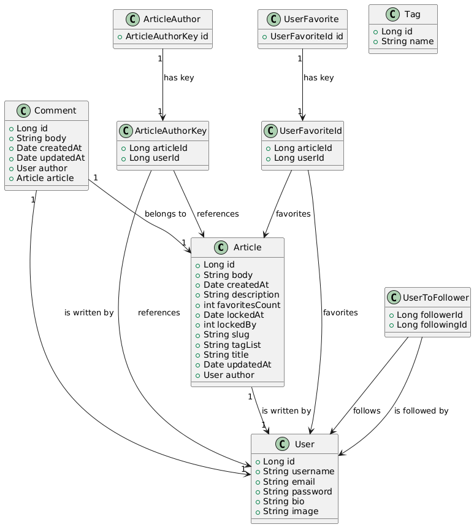

## 9. Sequence Diagrams

1.Login Sequence:

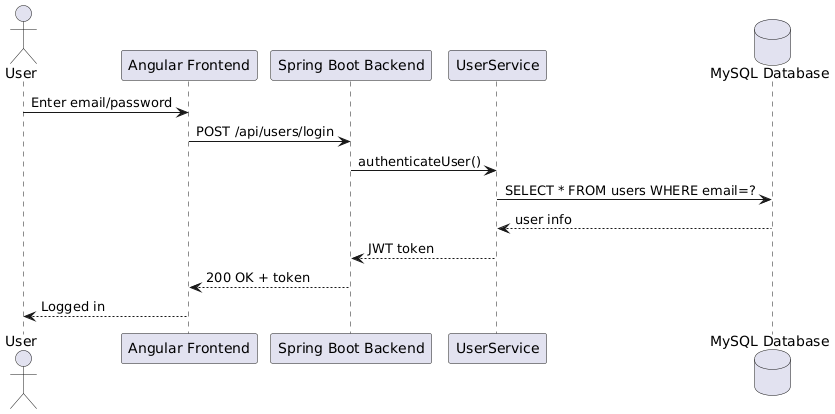

2.Create Article:

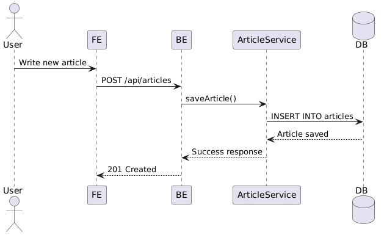

3.Comment on Article:

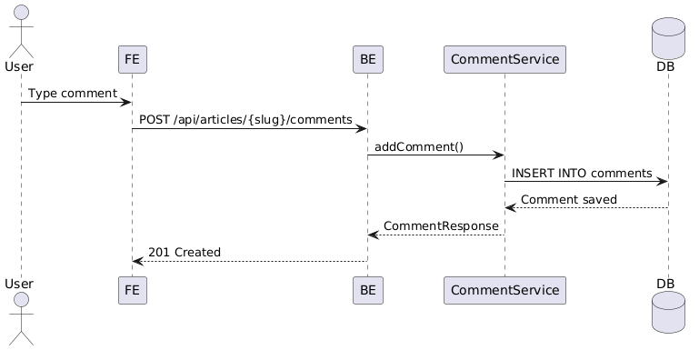

4.Follow User:

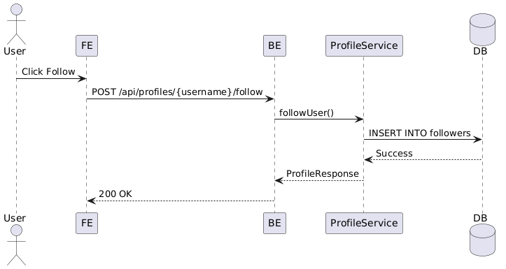

---

## 10. Screenshots

1. Login Page:

  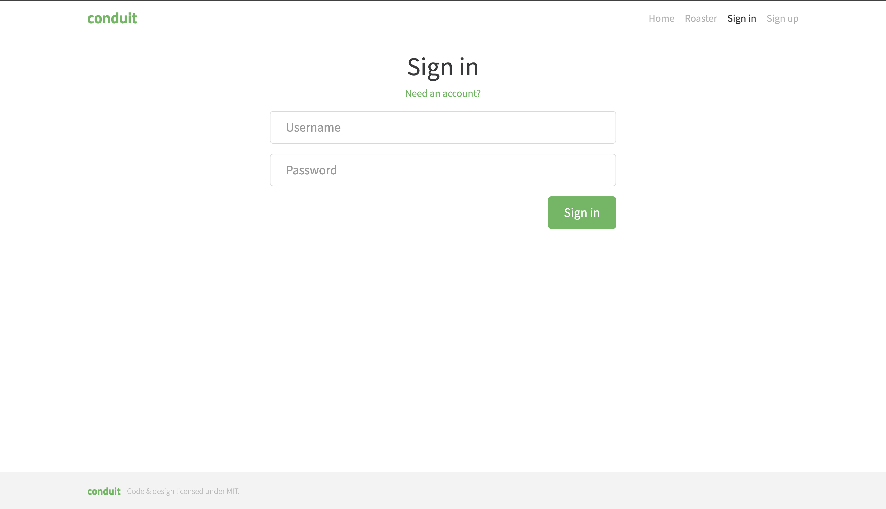  

2. Sign Up Page:

  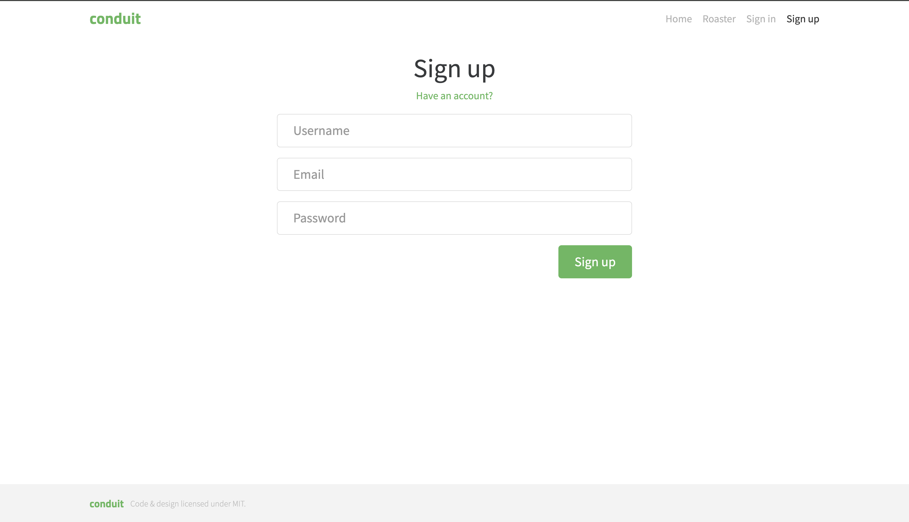

3. Home Page:

  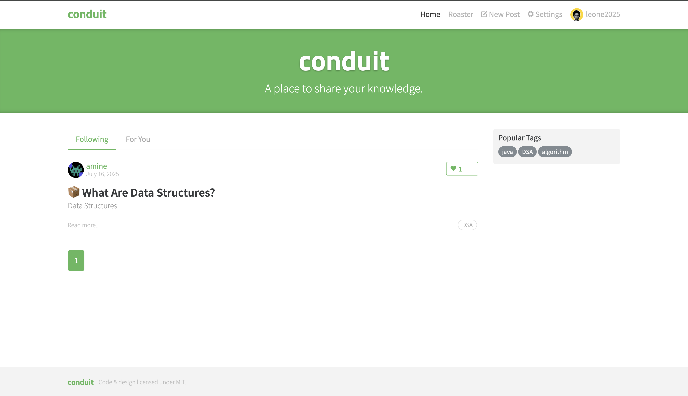 

4. Update Profile Page:
    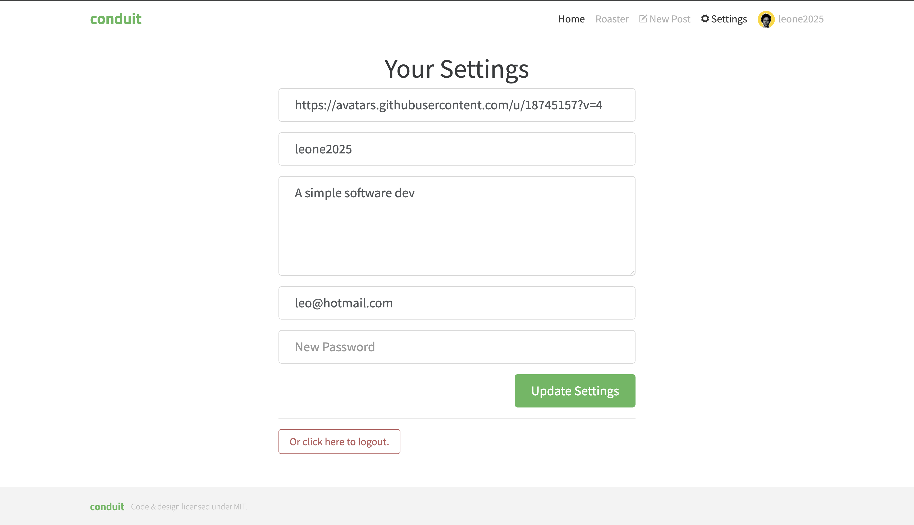

5. Post Article Page:
     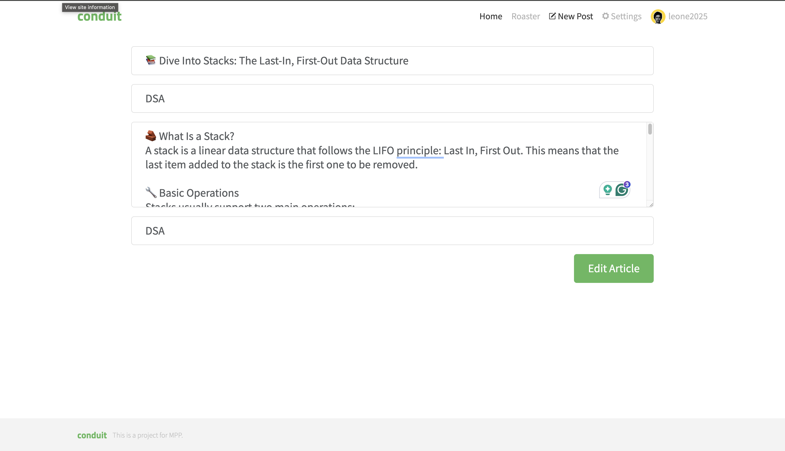  
6. Roastr Page:

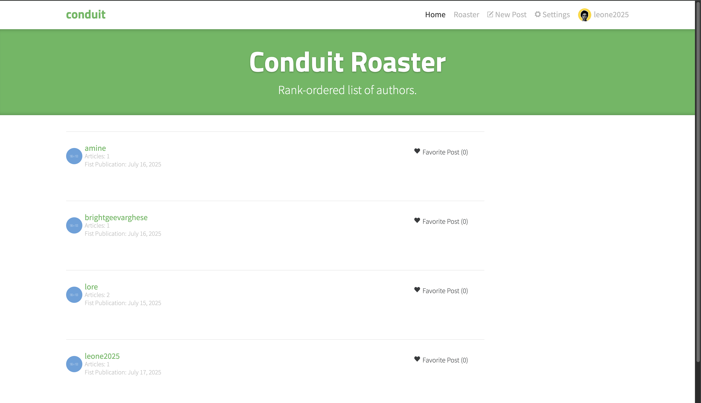  

7. User Profile Page:

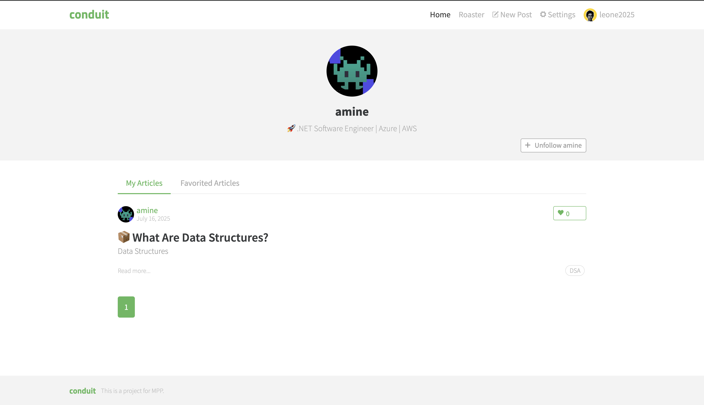

## 11. Installation & Deployment

Clone the Repository:
    git clone <https://github.com/amineatm/Conduit-App.git>
    cd conduit-app

Backend Setup (Spring Boot - Java):
    1. Create MySQL database:
        CREATE DATABASE conduit_db;
    2. Configure the connection in application.properties or application.yml: eg. application.properties:
        spring.datasource.url=jdbc:mysql://localhost:3306/conduit_db
        spring.datasource.username=root
        spring.datasource.password=your_password
    3. Seed initial data from data.sql (already configured by Spring Boot):
        -- Will auto-insert tags like 'coding', 'angular', 'java', etc.
    4. Run the app:
        ./gradlew bootRun or (run it from your IDE).

    The backend will be accessible at:
 <http://localhost:8092/swagger-ui/index.html/> (for API docs)

Frontend Setup (Angular)
    1. Go to the frontend folder:
        cd frontend
    2. Install dependencies:
        npm ci
    3. Run the frontend:
        npm start

    The frontend will run at:
 <http://localhost:4200/>

## 12. How to Use

 Login / Register:
    1. Visit <http://localhost:4200/> (Frontend)
    2. Register a new user or log in using simple username, email and password.

 Articles:
    1. Create an Article:
    Go to “New Article” tab → Fill title, description, body → Submit.
    2. Edit/Delete Your Article:
    Open your article → Click edit or delete.
    3.Favorite Articles:
    Click the ❤️ icon on articles you like.

 Comments:
    Open any article → Add a comment at the bottom.
    You can also edit/delete your own comments.

 Social Features:
    Visit another user's profile.
    Click “Follow” or “Unfollow” to manage subscriptions.
    Your feed will show articles from followed users.

 Tags:
    Tags are auto-generated from articles.
    Click a tag to filter articles with that tag.

## 13. Design Justification & Principles

We followed clean architecture principles to separate concerns:

    -Modular structure: Divided into controller, service, repository, and DTO layers.
    - Single Responsibility: Each class has one purpose (e.g., services handle business logic only).
    - DRY & Reusability: Used DTOs and utility classes to avoid code duplication.
    - Security: Used CurrentUser and Spring Security context for user authentication.
    - Testability: Dependency injection makes unit testing easier.

## 14. Team Members

[Leonardo Medina] — [619571] 

[Mohamed Amine Atmani] — [619560]

---

## 15. References

- [Spring Boot Documentation](https://docs.spring.io/spring-boot/docs/current/reference/html/)
- [Angular Official Documentation](https://angular.io/docs)
- [PlantUML Official Guide](https://plantuml.com/)
- [ChatGPT by OpenAI](https://chatgpt.com/)
- [Stack Overflow](https://stackoverflow.com/)

---

## Grading Rubric (Total: 10 Points)

| Criteria                                     | Points | Description / Expectations                                                                                   |
| -------------------------------------------- | :----: | ------------------------------------------------------------------------------------------------------------ |
| **Problem Description & User Stories**       |    1   | Clearly states the problem and provides meaningful, relevant user stories.                                   |
| **Functional & Non-Functional Requirements** |    1   | Functional and non-functional requirements are complete, clear, and relevant.                                |
| **Architecture & Design**                    |    1   | Well-structured layered architecture, clear diagrams (class, sequence, use case), thoughtful design.         |
| **Use of Stream API**                        |    1   | Appropriately uses Java Stream API wherever possible; usage is clear and well-documented.                    |
| **Singleton Pattern (when applicable)**      |    1   | Applies the Singleton pattern where necessary; justification provided in documentation.                      |
| **Unit Testing**                             |    1   | Implements unit tests for key business logic; tests are meaningful and cover main cases.                     |
| **Implementation Quality**                   |    1   | Code quality: modularity, clean structure, meaningful naming, adherence to SOLID principles, error handling. |
| **Deployment, Installation & Usability**     |    1   | Clear setup instructions, successful deployment, working UI/CLI, and usability.                              |
| **Documentation & Reporting**                |    1   | Detailed README: all sections complete (screenshots, diagrams, instructions, principles, references, etc).   |
| **Presentation & Teamwork**                  |    1   | Professionalism in presentation (repo, submission, screenshots), teamwork (if applicable), and originality.  |
| **Total**                                    | **10** |                                                                                                              |
